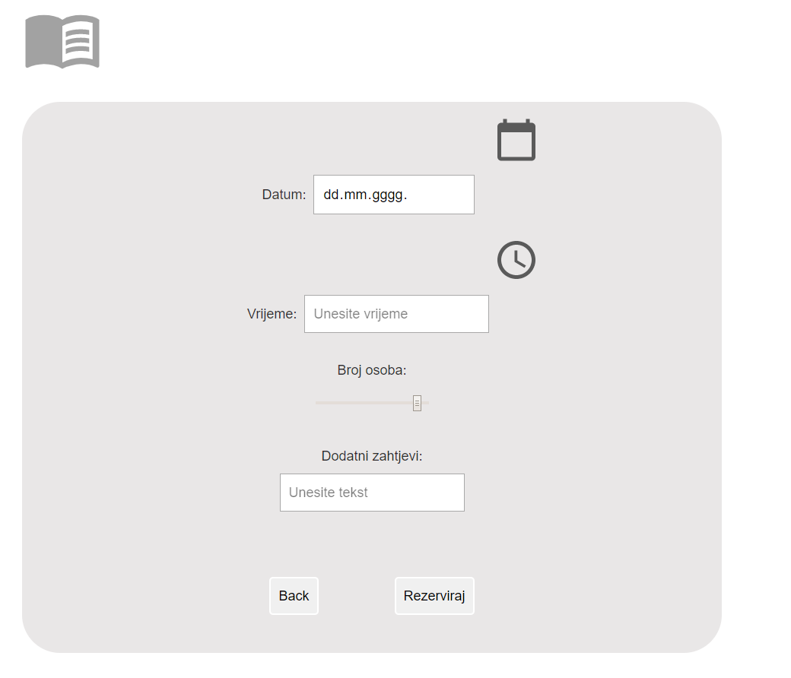

# RestoranApp <!-- omit in toc -->

<!-- markdownlint-disable MD007 -->

- [Uvod](#uvod)
  - [Korisnici](#korisnici)
  - [Ograničenja korištenja sustava](#ograničenja-korištenja-sustava)
  - [Zadaće i zahtjevi sustava](#zadaće-i-zahtjevi-sustava)
- [Low fidelity prototip](#low-fidelity-prototip)
  - [Desktop verzija _low fidelity_](#desktop-verzija)
  - [Mobilna verzija _low fidelity_](#mobilna-verzija)
- [High fidelity prototip](#high-fidelity-prototip)
  - [Desktop verzija _high fidelity_](#desktop-verzija-high-fidelity)
  - [Mobilna verzija _high fidelity_](#mobilna-verzija-high-fidelity)
- [Heuristike](#heuristike)
  - [Podudaranje stvarnog svijeta sa sustavom](#podudaranje-stvarnog-svijeta-sa-sustavom)
  - [Konzistencija i standardi](#konzistencija-i-standardi)
  - [Vidljivost statusa sustava](#vidljivost-statusa-sustava)
  - [Sloboda korisnika i korisnička kontrola](#sloboda-korisnika-i-korisnička-kontrola)
  - [Sprečavanje grešaka](#sprečavanje-grešaka)
  - [Detekcija i oporavak od greške](#Detekcija-i-oporavak-od-greške)
  - [Prepoznavanje umjesto prisjećanja](#prepoznavanje-umjesto-prisjećanja)
  - [Fleksibilnost i efikasnost korištenja](#fleksibilnost-i-efikasnost-korištenja)
  - [Estetika i minimalistički dizajn](#estetika-i-minimalistički-dizajn)
  - [Pomoć i dokumentacija](#pomoć-i-dokumentacija)
- [C.R.A.P. principi](#C.R.A.P-principi)
  - [Contrast](#contrast)
  - [Repetition](#repetition)
  - [Alignment](#alignment)
  - [Proximity](#proximity)
- [Zaključak](#zaključak)

## Uvod

Internetske narudžbe već duži niz godina predstavljaju jedan od standarda moderne tehnologije, s neprekidnom tendencijom rasta. Cilj ove web aplikacije je omogućiti pregled trenutne ponude prehrambenih proizvoda i jela, mogućnost dostave, pregled slobodnih mjesta u slučaju rezervacije mjesta, te opcija dolaska po gotov proizvod uz predviđeno približno točno vrijeme realizacije usluge.

### Korisnici

Aplikacija je namijenjena širokom krugu korisnika svih dobnih grupa, osnovne razine informatičkog znanja.

### Ograničenja korištenja sustava

Za korištenje stranice potreban je pristup internetu uz web preglednik novije verzije instaliran na osobnom računalu ili mobilnom uređaju.

### Zadaće i zahtjevi sustava

Nužni zahtjevi i zadaće koje bi web aplikacija trebala ispunjavati:

- Aplikacija će se koristiti iz web preglednika
- Aplikacija će se koristiti na uređajima razičite veličine (_smartphones_, tableti, laptopi i desktop računala)
- Korisniku je omogućeno pretraživati/filtrirati produkte ili usluge
- Broj produkata/usluga koji se nude putem web aplikacije veći je od 20
- Korisnik će koristiti aplikaciju kao gost ili će se logirati u vlastiti profil
- Broj -javnih- stranica (one stranice koje ne zahtjevaju logiranje u sustav) je 5
- Jedna od javnih stranica je blog (blog mora sadržavati minimalno 20 _postova_ koje mogu uključivati slike, videa, _code snippet_-e)

## Low fidelity prototip

Uzimajući u obzir zahtjeve i zadaće sustava izrađen je _low fidelity_ prototip uz korištenje [Figma](https://www.figma.com) dizajnerskog alata.

### Desktop verzija

<!-- markdownlint-disable MD033 -->

    
      
    <em>Low fideltiy - početna</em>

<!-- markdownlint-disable MD033 -->

<!-- markdownlint-disable MD033 -->

    
      
    <em>Low fidelity - ponuda</em>

<!-- markdownlint-disable MD033 -->

<!-- markdownlint-disable MD033 -->

    
      
    <em>Low fidelity - narudžbe</em>

<!-- markdownlint-disable MD033 -->

<!-- markdownlint-disable MD033 -->

    
      
    <em>Low fidelity - rezervacije</em>

<!-- markdownlint-disable MD033 -->

<!-- markdownlint-disable MD033 -->

    
      
    <em>Low fidelity - blog</em>

<!-- markdownlint-disable MD033 -->

<!-- markdownlint-disable MD033 -->

    
      
    <em>Low fidelity - prijava i registracija</em>

<!-- markdownlint-disable MD033 -->

### Mobilna verzija

<!-- markdownlint-disable MD033 -->

    
      
    <em>Low fidelity - početna - mobilna verzija</em>

<!-- markdownlint-disable MD033 -->

<!-- markdownlint-disable MD033 -->

    
      
    <em>Low fidelity - ponuda - mobilna verzija</em>

<!-- markdownlint-disable MD033 -->

<!-- markdownlint-disable MD033 -->

    
      
    <em>Low fidelity - narudžbe - mobilna verzija</em>

<!-- markdownlint-disable MD033 -->

<!-- markdownlint-disable MD033 -->

    
      
    <em>Low fidelity - rezervacije - mobilna verzija</em>

<!-- markdownlint-disable MD033 -->

<!-- markdownlint-disable MD033 -->

    
      
    <em>Low fidelity - blog - mobilna verzija</em>

<!-- markdownlint-disable MD033 -->

<!-- markdownlint-disable MD033 -->

    
      
    <em>Low fidelity - prijava i registracija - mobilna verzija</em>

<!-- markdownlint-disable MD033 -->

## High fidelity prototip

Nakon izrade _low fidelity_ prototipa, izrađen je _high fidelity_ prototip. Pogodan je za vršenje evaluacije, a može se relativno lako izmjenjivati. Prethodno navedeni alat [Figma](https://www.figma.com) dodatno nudi mogućnost simuliranja ponašanja grafičkog sučelja. Konačno dobiveni _high fidelity_ prototip često daje vjerodostojan izgled konačnog proizvoda.

### Desktop verzija high fidelity

<!-- markdownlint-disable MD033 -->

    
      
    <em>High fidelity - početna</em>

<!-- markdownlint-disable MD033 -->

<!-- markdownlint-disable MD033 -->

    
      
    <em>High fidelity - ponuda</em>

<!-- markdownlint-disable MD033 -->

<!-- markdownlint-disable MD033 -->

    
      
    <em>High fidelity - narudžbe</em>

<!-- markdownlint-disable MD033 -->

<!-- markdownlint-disable MD033 -->

    
      
    <em>High fidelity - rezervacije</em>

<!-- markdownlint-disable MD033 -->

<!-- markdownlint-disable MD033 -->

    
      
    <em>High fidelity - blog</em>

<!-- markdownlint-disable MD033 -->

<!-- markdownlint-disable MD033 -->

    
      
    <em>High fidelity - prijava i registracija</em>

<!-- markdownlint-disable MD033 -->

### Mobilna verzija high fidelity

<!-- markdownlint-disable MD033 -->

    
      
    <em>High fidelity - početna - mobilna verzija</em>

<!-- markdownlint-disable MD033 -->

<!-- markdownlint-disable MD033 -->

    
      
    <em>High fidelity - ponuda - mobilna verzija</em>

<!-- markdownlint-disable MD033 -->

<!-- markdownlint-disable MD033 -->

    
      
    <em>High fidelity - narudžbe - mobilna verzija</em>

<!-- markdownlint-disable MD033 -->

<!-- markdownlint-disable MD033 -->

    
      
    <em>High fidelity - rezervacije - mobilna verzija</em>

<!-- markdownlint-disable MD033 -->

<!-- markdownlint-disable MD033 -->

    
      
    <em>High fidelity - blog - mobilna verzija</em>

<!-- markdownlint-disable MD033 -->

<!-- markdownlint-disable MD033 -->

    
      
    <em>High fidelity - prijava i registracija - mobilna verzija</em>

<!-- markdownlint-disable MD033 -->

## Heuristike
Jacob Nielsen i Rolfa Molich definirali su 10 heuristika koje su predstavljene u knjizi "Heuristička procjena
korisničkog sučelja". Imajući na umu navedene heuristike u nastavku rada je analizirana kvaliteta sučelja po pojedinim točkama.

### Podudaranje stvarnog svijeta sa sustavom

Ova smjernica savjetuje da bi sustav trebao „govoriti jezikom korisnika“ tj. koristiti izraze, fraze i koncepte poznate korisniku.
Web aplikacija RestApp koristi hrvatski jezik i jednostavne riječi koje bi trebale bit prepoznatljive
korisnicima.

### Konzistencija i standardi

Ova heuristika nam nalaže da sustav mora slijediti inicijalno postavljane konvencije, svi elementi i procesi na stranici moraju biti
jednoznačno definirani i u sprezi.
Budući da je ovaj sustav web aplikacija, koriste se
standardi i konvencije specifične za prikaz podataka na webu. Navigacijska traka
nalazi se na vrhu stranice.

### Vidljivost statusa sustava

Sustav bi trebao informirati korisnika o događanjima u web sustavu uz prikladan _feedback_.
U ovoj prototipskoj implementacijskoj fazi još nema primjer takve upotrebe.

### Sloboda korisnika i korisnička kontrola

Kod ove heuristike treba voditi računa o činjenici da korisnici mogu slučajno odabrati funkcionalnost
koju nisu namjeravali te im treba omogućiti jednostavno napuštanje neželjene opcije.
Sloboda korisnika ostvarena je preko trake izbornika, korisnik može uvijek pristupiti svim dijelovima
aplikacije. Pritiskom na logo aplikacije ili _home_ ikonu u navigacijskoj traci, u slučaju potrebe, korisnik se vraća na početnu stranicu.
Prilikom pregledavanja naručenih jela, korisnik bi se pritiskom na dugme "Natrag", trebao moći vratiti na prikaz ponuđenih jela i dodatno modificirati listu narudžbe.
Prototipu nedostaje značajan dio implementacije navedene heuristike.

    
      
    <em>Primjer korisničke kontrole</em>

### Sprečavanje grešaka

Ova smjernica savjetuje da je sustav koji sprječava nastanak grešaka bolji od onoga koji nudi dobre obavijesti o nastalim greškama.
Važno je eliminirati dijelove sučelja koji uzrokuju greške i tražiti potvrde korisnika tijekom izvršavanja akcija.
Aplikacija je dizajnirana sukladno ovoj heuristici, stoga postoje samo jednostavne funkcionalnosti
kod kojih ne bi trebalo dolaziti do grešaka prilikom korištenja. Sustav je u početnoj fazi razvoja i ova heuristika nije trenutno provedena u djelo.

### Detekcija i oporavak od greške

Kod ove heuristike važno je da obavijesti o greškama budu jednostavne i razumljive te da je ponuđen način rješavanja nastalog problema.
Obavijesti o greškama moraju biti napisane razumljivim jezikom (bez kodova),

### Prepoznavanje umjesto prisjećanja

Ova smjernica nalaže da sustav treba minimizirati količinu informacija, objekata, akcija i opcija koje
korisnik mora zapamtiti. Korisnik ne smije biti prisiljen pamtiti informacije unutar dijaloga ili interakcije sa sustavom.
Upute trebaju biti vidljive ako neka stavka nije intuitivna sama po sebi.
Ova heuristika korištena je u komponenti za rezervaciju mjesta u restoranu. Većini korisnika je bez dodatnih uputa jasno kako ispuniti ponuđena polja prikazana na slici,
iako komponenta sadržava i neke nedostatake (slide bar bi trebao imati i oznaku broja).

    
      
    <em>Primjer prepoznavanja umjesto prisjećanja</em>

### Fleksibilnost i efikasnost korištenja

Fleksibilnost i efikasnost korištenja nam govori da sustav treba biti takav da dobro odgovara i novom i uhodanom korisniku.
Akceleratori (često neprimjećeni od strane novih korisnika) mogu ubrzati interakcije iskusnih korisnika sa sustavom.
Prototip je u ranoj fazi implementacije i ne sadržava dobar primjer ove heuristike.

### Estetika i minimalistički dizajn

Ova smjernica savjetuje da dijalozi ne smiju sadržavati informacije koje su irelevantne ili se
rijetko koriste. Svaka dodatna informacija smanjuje vidljivost važnijih informacija.
Glavna stranica aplikacije je izvedena u duhu minimalističkog dizajna uz dozu estetike.

    
      
    <em>Primjer estetike i minimalističkog dizajna</em>

### Pomoć i dokumentacija

Ova stavka govori kako ne bi bilo na odmet imati dokumentaciju koja će u slučaju potrebe pomoći korisniku pri upotrebi aplikacije.
Zbog jednostavnosti aplikacije i njene početne faze razvoja, nije implementiran priručnik za pomoć.

## C.R.A.P. principi

C.R.A.P. (_Contrast Repetition Alignemnt Proximity_) skup jednostavnih principa dizajna korišten je kako bi se postigao što bolji dizajn aplikacije. U sljedećim poglavljima su objašnjeni i prikazani na primjerima. 

### Contrast

Kontrast usredotočuje korisnikovu pažnju i treba ga koristiti za isticanje najvažnijih dijelova korisničkog sučelja, za koje je važno da ih se što lakše uoči. Slika početne stranice sustava prethodno postavljena pod heuristikom "Estetika i minmalistički dizajn" može poslužiti kao primjer upotrebe kontrasta. Također u prikazu _high fidelity_-a, slike ponude i narudžbe koriste se principom kontrasta za isticanje pojedinih elemenata sustava (funkcionalni klikabilni elementi).

### Repetition

Ponavljanje dizajna kroz sučelje je važno za stvaranje jedinstva među elementima i održavanje konzistentnosti.
Pod tim načelom su elementi sličnog značaja i funkcionalnosti prikazani istim fontom, veličinom i bojom. Upotreba ovog principa je jasno vidljiva na slikama u poglavlju _high fidelity_-a.

### Alignment

Ništa na stranici ne smije biti na proizvoljnom mjestu. Čak i kada ne postoje linije koje povezuju
elemente naše oko i mozak ih stvaraju i bolje reagiraju kada su elementi vizualnog sučelja međusobno ovisno pozicionirani.
U aplikaciji se pravilo poravnavanja primjenjuje na većinu elemenata. Iako neke od komponenti mogu kroz ovu stavku biti poboljšane, većina elemenata velikim dijelom zadovoljava
načelo ovog principa.

### Proximity

Blizina između vizualnih elemenata može doprinijeti stvaranju relevantnosti, hijerarhije ili organiziranosti strukture u konačnom prikazu stranice.
Upotreba ovog principa vidljiva je na slikama ponude i bloga u _high fidelity_ poglavlju gdje blizina (_proximity_) među elementima značajno olakšava predočavanje stranice korisniku.
Tako će korisnik s lakoćom znati da ova četiri grupirana elementa predstavljaju prikaz ponude za narudžbu. U ovom primjeru je poštovan i _alignment_ pricnip.

    
      
    <em>Primjer proximity-a</em>

Ovaj princip ispunjen je i kod početne stranice gdje su dvije glavne funkcionalnosti aplikacije (_Naruči i Rezerviraj_) jednake važnosti te su stoga postavljeni jedan do drugoga.

## Zaključak

Tijekom izrade prototipa i web aplikacije lako je bilo primijetiti kako planiranje dizajna uvelike olakšava sav daljnji razvoj projekta.
Bez izrade _low_ i _high fidelity_ prototipa, razvoj do krajnjeg produkta bio bi značajno otežan. Osim što navedeni prototipovi omogućavaju dobar uvid u razvoj i potrebe sustava, također olakšavaju izmjenu i evaluacija sustava. Osim toga, korištenjem i poštivanjem pravila heuristike i C.R.A.P. principa osiguravamo dobar dizajn, i smanjujemo moguće poteškoće prilikom korištenja aplikacije.
Iako mnogi ljudi prirodno nemaju osjećaj za dobar dizajn, koristeći navedena pravila i
principe svatko može napraviti zadovoljavajući dizajn koji će biti intuitivan i jednostavan za korištenje.